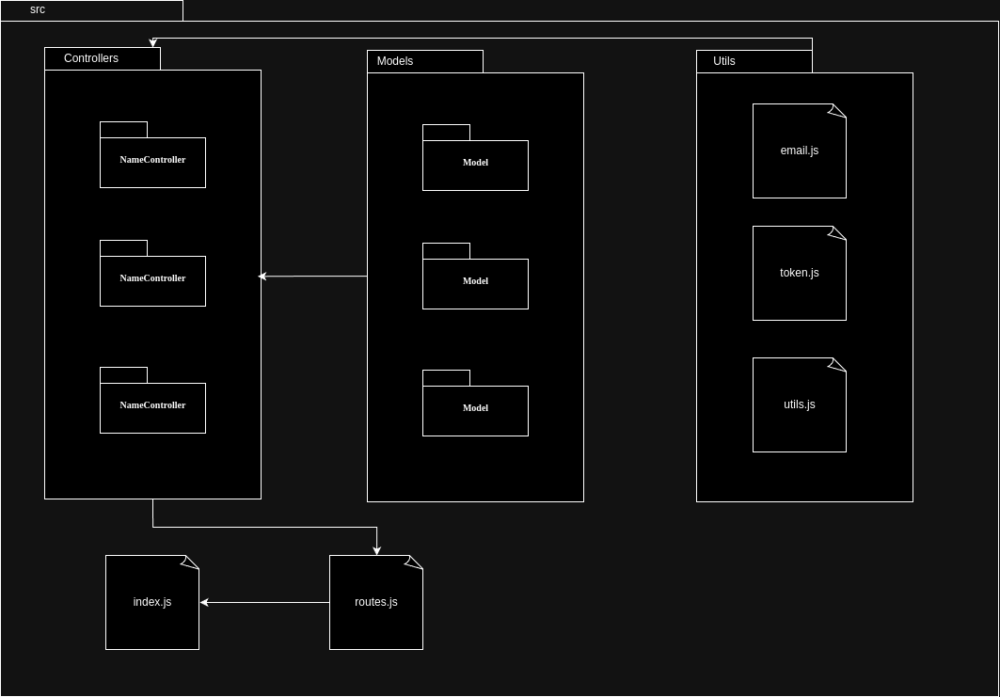

# Arquitetura de Software

## Visão Geral

A arquitetura deste sistema é composta por uma interface central que se comunica com três microsserviços distintos: Usuários, Financeiro e Benefícios.

Os microsserviços são responsáveis por áreas funcionais específicas e se comunicam de forma assíncrona e segura através de APIs. Cada microsserviço expõe uma interface de API que permite que a interface central e os outros microsserviços realizem operações conforme necessário.

A separação dos microsserviços e seus bancos de dados permite a escalabilidade independente de cada componente. Alterações e manutenções em um microsserviço não afetam diretamente os outros, promovendo uma arquitetura facilmente adaptável a mudanças.

## Componentes da Arquitetura

### 1. **Interface**

A interface atua como o ponto de entrada para os usuários e sistemas externos, permitindo a interação com o sistema de forma integrada. Esta camada é responsável por:

- **Recepção de Requisições**: Captura e valida as requisições dos usuários ou sistemas externos.
- **Autenticação e Autorização**: Garante que as requisições sejam realizadas por usuários autorizados e autenticados.
- **Orquestração de Requisições**: Coordena as interações entre os microsserviços, garantindo que as respostas sejam consolidadas e apresentadas ao usuário final de forma coesa.

### 2. **Microsserviço de Usuários**

O microsserviço de Usuários gerencia todas as operações relacionadas aos usuários do sistema.

**Banco de Dados do Usuários**: O banco de dados associado a este microsserviço armazena informações detalhadas sobre cada usuário

### 3. **Microsserviço Financeiro**

O microsserviço Financeiro é responsável por gerenciar todas as transações e operações financeiras.
**Banco de Dados do Financeiro**: O banco de dados deste microsserviço armazena dados relacionados a fornecedores, contas e históricos financeiros.

### 4. **Microsserviço de Benefícios**

O microsserviço de Benefícios cuida da administração dos benefícios/convênios oferecidos aos sindicalizados.
**Banco de Dados de Benefícios**: O banco de dados deste microsserviço armazena informações sobre os benefícios disponíveis.

## Tecnologias

### 1. React/ViteJS
React é a principal biblioteca utilizada no frontend deste projeto, focada na construção de interfaces de usuário reativas e componentizadas. Com sua abordagem baseada em componentes, o React permite um desenvolvimento modular, facilitando a reutilização de código e a manutenção do sistema. A escolha de ViteJS como o build tool agiliza o processo de desenvolvimento, fornecendo uma experiência de desenvolvimento mais rápida e eficiente, com suporte nativo a ESModules e hot module replacement (HMR). Juntos, React e ViteJS proporcionam uma interface de usuário moderna, dinâmica e altamente responsiva.

### 2. Node.js
Node.js é utilizado no projeto como o ambiente de execução para o backend, graças ao seu modelo de execução assíncrono e não bloqueante. Essa característica é essencial para lidar com um grande número de requisições simultâneas, tornando-o ideal para a construção de APIs rápidas e escaláveis. Além disso, Node.js é multiplataforma e possui uma vasta biblioteca de pacotes NPM, que facilita a integração de funcionalidades adicionais no backend, promovendo agilidade no desenvolvimento e flexibilidade na escolha de tecnologias.

### 3. Express
Express é o framework Node.js escolhido para estruturar as APIs do backend, fornecendo uma camada leve e flexível para o desenvolvimento de rotas e middleware. Sua simplicidade e desempenho eficiente permitem a criação de APIs RESTful de maneira rápida, sem sacrificar a robustez. Através do uso de middlewares, o Express facilita o gerenciamento de requisições, tratamento de erros, autenticação e integração com serviços externos, assegurando uma comunicação eficaz entre o frontend e o banco de dados, bem como entre diferentes microsserviços.

### 4. MongoDB
MongoDB é empregado como o banco de dados NoSQL neste projeto, oferecendo uma solução flexível e escalável para o armazenamento de dados. Sua estrutura baseada em documentos JSON permite um mapeamento direto dos dados para objetos em linguagens de programação, simplificando a manipulação de informações complexas. O MongoDB é altamente escalável, sendo uma escolha apropriada para aplicações que exigem alta disponibilidade e capacidade de crescimento dinâmico dos dados, características essenciais para atender às demandas do projeto.

### 5. Mongoose
Mongoose é a biblioteca ODM (Object Data Modeling) utilizada para gerenciar interações com o MongoDB, proporcionando uma camada de abstração que simplifica o mapeamento de objetos JavaScript para documentos do banco de dados. Com Mongoose, é possível definir schemas rigorosos, realizar validações automáticas e criar relações complexas entre documentos. Essa tecnologia contribui para um desenvolvimento backend mais organizado e seguro, garantindo que os dados sejam consistentes e validados antes de serem armazenados no banco de dados MongoDB.

## Visão lógica

### Diagrama de Pacotes

#### Diagrama de Pacotes Frontend

Os principais componentes do diagrama são:

* src: A pasta raiz do seu projeto, onde reside todo o código fonte.
Components: Aqui você encontrará os componentes reutilizáveis da sua aplicação. Um componente React é um pedaço de interface que pode ser renderizado independentemente e, geralmente, encapsula lógica e estilo.

* Pages: Nesta pasta, você irá encontrar os componentes que representam as diferentes páginas do seu aplicativo. Cada página é, essencialmente, um grande componente que pode conter outros componentes menores.

* Service: Essa pasta geralmente contém a lógica de negócios da sua aplicação, como funções para fazer requisições a APIs, manipular dados, etc.

* Context: Aqui você define o contexto da sua aplicação, uma forma de gerenciar estado global sem precisar passar props por várias camadas de componentes.

* Utils: Contém funções utilitárias que podem ser usadas em diversas partes do seu código, como funções de formatação, validação, etc.

* Assets: Armazena arquivos estáticos como imagens, fontes, etc.

* App: O componente principal da sua aplicação, que renderiza todas as outras partes.

#### Diagrama de Pacotes Backend

Os principais componentes do diagrama são:

* src: A pasta raiz do projeto, como no diagrama original.

* controllers: Contém a lógica de negócios específica de cada recurso (usuários, produtos, etc.).
Cada controlador expõe um conjunto de endpoints (rotas) que podem ser chamados por clientes.
Exemplo: UserController.js poderia ter métodos como createUser, getUserById, updateUser.

* models: Representam as estruturas de dados do seu aplicativo, definindo os esquemas para os seus dados.
Geralmente, se mapeiam para tabelas em um banco de dados.

* utils: Contém funções utilitárias que podem ser usadas em diversas partes do código, como enviar emails, gerar tokens, etc.

* routes: Definem as rotas da sua aplicação, ou seja, os caminhos que os clientes podem acessar. Cada rota é mapeada para um método específico em um controlador.

* index.js:
É o ponto de entrada da sua aplicação, onde você inicializa o servidor Express.

## Diagramas Lógico de Dados (DLD)

O Diagrama Lógico de Dados (DLD) é uma representação gráfica que detalha a estrutura de um banco de dados. Ele mostra como as informações serão armazenadas, quais são as relações entre elas e como essas informações serão organizadas para facilitar a recuperação e a manipulação dos dados.
Para ilustrar o DER, dividimos entre os micro serviços:

### Users

### Finance

### Benfits

## 5. Referências Bibliográficas

AMAZON AWS. O que são microsserviços?. Disponível em: https://aws.amazon.com/pt/microservices/.

Geeks-for-geeks. Package Diagram | Introduction, Elements, Use Cases and Benefits. Disponível em: https://www.geeksforgeeks.org/package-diagram-introduction-elements-use-cases-and-benefits/

## Histórico de Versão

| Alteração            | Data     | Autor       |
| -------------------- | -------- | ----------- |
| Criação do documento | 28/07/24 | Sara Campos |
| Finalização do documento | 08/09/2024 | Victor Yukio |
