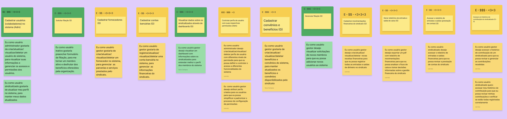
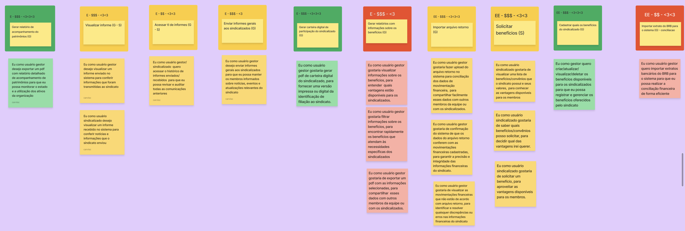
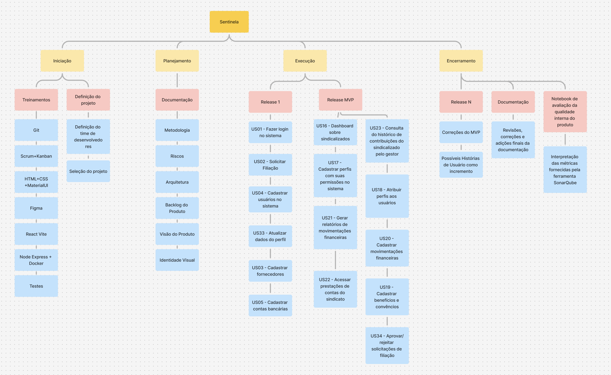

# Backlog do produto

O backlog do produto foi definido a partir do sequenciador instanciado durante o Lean Inception. Como pode ser visto abaixo, era planejado o desenvolvimento de 12 funcionalidades como o MVP.

Com o sequenciador em mãos, o time se reuniu e começou a detalhar todas as funcionalidades a nível de Histórias de Usuários, que viriam a compor o Backlog do Produto. Na imagem abaixo é possível ver que quinze histórias foram instanciadas a partir das funcionalidades do MVP.

Além disso, todas as outras funcionalidades de incremente foram detalhadas a nível de US.

O Backlog do produto, composto por todas as US, foi planejado na [EAP](../gestao/eap.md) seguindo as entregas de Release 1, Release MVP e Release N esperadas na matéria. Com a EAP apresentada ao cliente e validada, o quadro Zenhub foi atualizado com as US e pode ser acessado pelas [issues](https://github.com/fga-eps-mds/2024.1-SENTINELA-DOC/issues) do Github, ou por meio da instalação de extensão Zenhub. Além disso, o [Roadmap](https://app.zenhub.com/workspaces/sentinela-20241-6600879e9c18ff20971a451a/roadmap) foi atualizado.

A EAP, no entanto, não permite uma visualização do que foi entregue aos P.Os, nem de US adicionadas conforme necessidade. Abaixo segue uma tabela com as 15 US planejadas na EAP e 1 US adicionada no andamento do projeto, bem como suas respectivas situações de entrega.

| Código da US | Descrição                                                                               | Aceitação                                                                                                                                                                             |
| ------------ | --------------------------------------------------------------------------------------- | ------------------------------------------------------------------------------------------------------------------------------------------------------------------------------------- |
| US01         | Fazer login no sistema                                                                  | Aceita pelo P.O Matheus em 02/09                                                                                                                                                      |
| US02         | Solicitar filiação                                                                      | Aceita pelo P.O Matheus em 19/08, mas apresentou necessidade de uma melhoria no código abordada na ENH-US02                                                                           |
| US03         | Cadastrar fornecedores                                                                  | Aceita pelo P.O Matheus em 08/09                                                                                                                                                      |
| US04         | Cadastrar usuários                                                                      | Foi identificada uma necessidade de adaptação no código e no funcionamento para que refletisse a necessidade de ter usuário "genérico" e usuário filiado, mas isso não foi finalizado |
| US05         | Cadastrar contas bancárias                                                              | Aceita pelo P.O Matheus em 23/08, mas apresentou necessidade de uma melhoria no código abordada na ENH-US05                                                                           |
| US33         | Atualizar dados como sindicalizados                                                     | Aceita pelo P.O Matheus em 10/08                                                                                                                                                      |
| US16         | Dashboard de informações sobre filiados                                                 | Aceita pelo P.O Matheus em 31/08                                                                                                                                                      |
| US17         | Cadastrar perfis                                                                        | Enviada para aceitação com correções finais em 08/09                                                                                                                                  |
| US18         | Atribuir perfis                                                                         | Enviada para aceitação em 08/09                                                                                                                                                       |
| US19         | Cadastrar benefícios                                                                    | Aceita pelo P.O Matheus em 21/08                                                                                                                                                      |
| US20         | Cadastrar movimentações financeiras                                                     | Enviada para aceitação com correções finais em 06/09                                                                                                                                  |
| US21         | Gerar relatório de financeiro                                                           | Aceita pelo P.O Matheus em 09/09                                                                                                                                                      |
| US22         | Acessar prestação de contas                                                             | Com a entrada da US35 no Backlog do Produto, a US22 foi despriorizada num acordo entre time e P.Os, portanto, não foi entregue                                                        |
| US23         | Acessar histórico de contribuição dos sindicalizados                                    | Enviada para aceitação com correções finais em 08/09                                                                                                                                  |
| US34         | Gerenciar filiação                                                                      | Não aceita por conta de defeitos                                                                                                                                                      |
| US35         | Cadastrar órgãos/lotações (adicionado ao Backlog do Produto com o projeto em andamento) | Enviada para aceitação em 02/09                                                                                                                                                       |

Apesar de entregues aos P.Os, algumas US apresentaram defeitos, que são explicitados no documento de [Melhorias e defeitos](./melhorias-defeitos.md).

## Histórico de Versões

| Alteração                                                                    | Data     | Autor       |
| ---------------------------------------------------------------------------- | -------- | ----------- |
| Criação do documento                                                         | 08/09/24 | Sara Campos |
| Atualização a partir do feedback do P.O (Atualiza aceitação de US na tabela) | 09/09/24 | Sara Campos |
