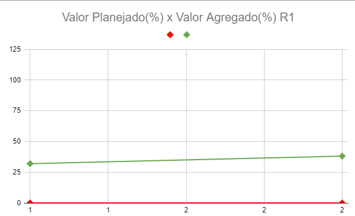
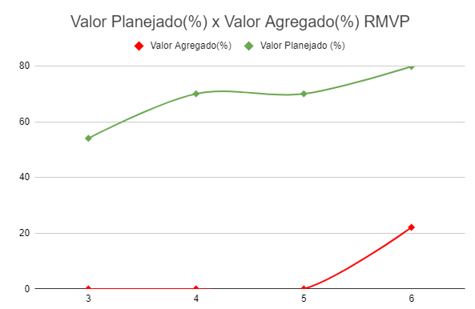
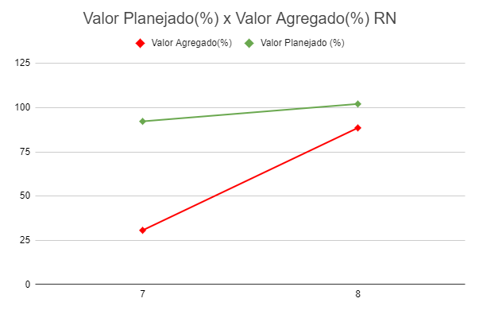
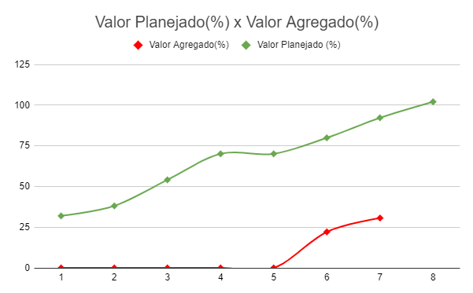

# EVM - Earned Value Management

O EVM (Earned Value Management) é uma metodologia de gerenciamento de projetos que integra cronograma, custos e escopo para monitorar o desempenho do projeto. A partir de dados planejados e reais, o EVM permite criar expectativas de resultados futuros e ajustar o andamento conforme necessário. Dentro do EVM, uma ferramenta fundamental é a Análise de Valor Agregado (EVA), uma técnica quantitativa que avalia o desempenho do projeto ao calcular as variações no cronograma e nos custos.

Quando 20% do projeto está concluído, o desempenho atual pode ser usado para prever o futuro do projeto com uma margem de erro de aproximadamente 10%. Essa capacidade preditiva torna o EVM uma das mais eficazes ferramentas de controle de custos em projetos.

Caso exista maior interesse sobre a metodologia Agile EVM, o material referente à ela pode ser encontrado no seguinte artigo: [_AgileEVM – Earned Value Management in Scrum Projects_](https://34slpa7u66f159hfp1fhl9aur1-wpengine.netdna-ssl.com/wp-content/uploads/2014/11/Earned-Value-Analysis-in-Scrum-Projects.pdf). Foi utilizada como base a tabela feita pelo grupo [**Ada**](https://fga-eps-mds.github.io/2019.1-ADA/#/docs/product/agile_earned_value_management).

## EVM - Sentinela

O processo de monitoramento do projeto se iniciou junto à primeira sprint de desenvolvimento, a Spritn 1. Com os custos do projto já relatados no documento de [Custos](custos.md).

O acesso à planilha incluindo a tabela e referentes g´raficos pode ser encontrado [aqui](https://docs.google.com/spreadsheets/d/1SBTl11r1Ljvw7XKt4Z5t6L6VxT39uDKFdNz4LeyCeis/edit?usp=sharing).

<iframe src="https://docs.google.com/spreadsheets/d/1SBTl11r1Ljvw7XKt4Z5t6L6VxT39uDKFdNz4LeyCeis/edit?usp=sharing" width="900px" height="600px"></iframe>

## Análise das Major Releases

Baseando-se nos gráficos gerados por sprint com suas referências de Valor Agregado x Valor Planejado é possível tirar conclusões sobre cada uma das major releases entregue pela equipe.

### Release 1

A Release 1 contou com duas semanas totais de desenvolvimento, com um planejamento do valor agregado do sistema próximo à 25% do total esperado. Porém por dificuldades iniciais da equipe no processo de desenvolvimento o valor total entregue e aceito não alcançou essa meta.

### MVP

A entrega da Release MVP consistiu em 4 semanas completas de desenvolvimento. Como pode ser verificado pelo gráfico, as primeiras semanas de desenvolvimento não trouxeram nenhum valor agregado enquanto o valor planejado continuava crescendo. Quanto ao valor planejado, esse cescimento constante se dava pela utilização de metodologias ágeis por parte da equipe que se baseiam na entrega contínua de valor. Já o comportamento do valor agregado pode ser relacionado com tanto a necessidade de reescrita e organização de critérios de aceitação e histórias de usuário, quanto à demora por parte do cliente para validação das histórias entregues.

### Release N

Para a entrega final, o projeto contou com 2 sprints de desenvolvimento. O foco dessas sprints era finalizar as histórias de usuário similarmente à conrrigir possíveis erros de funcionalidade ou compreensão de histórias de usuário anteriores, de forma que o planejamento dessas sprints trouxe menor quantidade de pontos por sprint. Porém por conta de avanço na aceitação por parte do usuário tivemos maior quantidade de pontos de história fechados.

### Análise Total

Assim, analisando o gráfico total do projeto é possível ver uma estagnação da equipe para finalizar as entregas, muito passando pelos problemas citados de erros de comunicação levando à reescrita de histórias e critérios de aceitação, assim como a demora muitas vezes para validas as entregas já relizadas. Ainda assim, foi possível finalizar muitas das histórias do projeto.

## Histórico de Revisão

| Data       | Descrição            | Autor         |
| ---------- | -------------------- | ------------- |
| 08/09/2024 | Criação do Documento | Álvaro Gouvea |

## Referências

- AgileEVM – [Earned Value Management in Scrum Projects](https://34slpa7u66f159hfp1fhl9aur1-wpengine.netdna-ssl.com/wp-content/uploads/2014/11/Earned-Value-Analysis-in-Scrum-Projects.pdf). Último acesso em 08/09/2024.
