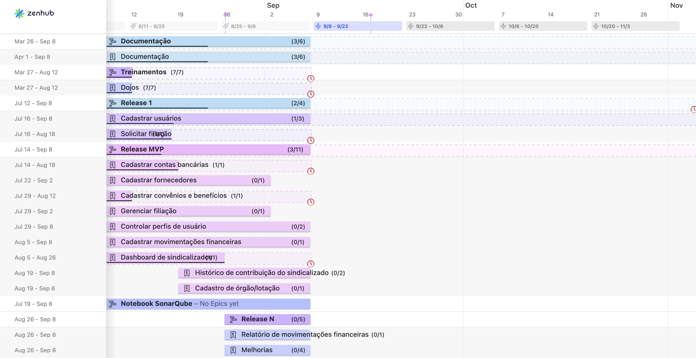

# Entregas e roadmap

O [Roadmap](https://app.zenhub.com/workspaces/sentinela-20241-6600879e9c18ff20971a451a/roadmap) do projeto foi criado a partir do que foi definido e validado na [EAP](./eap.md) e atualizado semanalmente conforme o andamento das atividades. Assim, os pacotes de trabalho foram representados no Roadmap, e épicos (funcionalidades do produto) foram associadas a eles. Os épicos, por fim, foram associados às Histórias de Usuário às quais se referiam.

Na data final de entrega do projeto, a situação do Roadmap era a seguinte:

O comportamento do roadmap, apesar de aparentar muitos atrasos, era o esperado para o fluxo de trabalho da disciplina, onde normalmente existe um período de espera da aceitação por parte dos P.Os e retorno de correções e melhorias. No geral, observa-se um bom prospecto, i.e das 16 US instanciadas para o projeto neste semestre (15 planejadas e 1 adicionada), foi possível entregar 14 delas.

As US foram divididas em 5 Releases totais (3 Major e 2 minors):

- Release 1 (_Major_):
  - US01 - Fazer login
  - US02 - Solicitar filiação
  - US04 - Cadastrar usuários
  - US33 - Atualizar dados de usuário
- Release 2 (_Minor_):
  - US17 - Cadastrar perfis no sistema
  - US05 - Cadastrar contas bancárias
- Release 3 (_Minor_):
  - US19 - Cadastrar benefícios
  - US02 - Solicitar filiação (Ajustes pedidos na Release 1)
  - US34 - Gerenciar filiações
- Release 4/MVP (_Major_)
  - US01 - Fazer login no sistema (Ajustes pedidos na Release 1)
  - US03 - Cadastrar fornecedores (Ajustes pedidos na Release 3)
  - US16 - Visualizar dashboard sobre os sindicalizados
  - US20 - Cadastrar movimentações financeiras
  - US23 - Consulta do Histórico de Contribuições do sindicalizado
  - US35 - Cadastro de órgão/lotação
  - US34 - Gerenciar solicitações de filiação (Ajustes pedidos na Release 2)
- Release 5/N (_Major_)
  - US03 - Cadastrar fornecedores (Ajustes pedidos na Release 4)
  - US20 - Cadastrar movimentações financeiras (Ajustes pedidos na Release 4)
  - US17 - Cadastrar perfis (Ajustes necessários identificados na Release 4)
  - US18 - Atribuir perfis
  - US21 - Gerar relatório de movimentações financeiras
  - ENH-US02 - Melhorias da US02
  - ENH-US05 - Melhorias da US05

## Histórico de Versões

| Alteração            | Data     | Autor       |
| -------------------- | -------- | ----------- |
| Criação do documento | 08/09/24 | Sara Campos |
