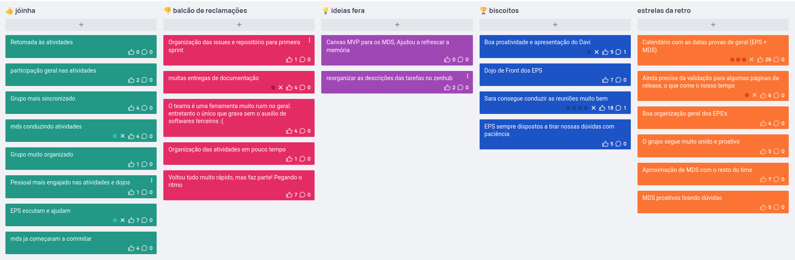

# Retrospectiva inicial
Nos dias iniciais da Sprint 1 foi realizada uma retrospectiva de maneira remota que gerou algumas reflexões.

## Pontos positivos e negativos

Na coluna "Estrelas da Retro" foram colocados os cards que tiveram mais reconhecimento do time, dos quais alguns foram encaminhados (como a planilha de datas provas, para melhorar o monitoramento de disponiblidade assim como de riscos), e outros (como comportamentos gerais do time) esperam ser mantidos.  

## Histórico de versão

| Alteração | Data | Autor | 
| - | - | - |
| Criação do documento | 15/07/24 | Victor Yukio |
| Revisão | 18/07/24 | Sara Campos | 