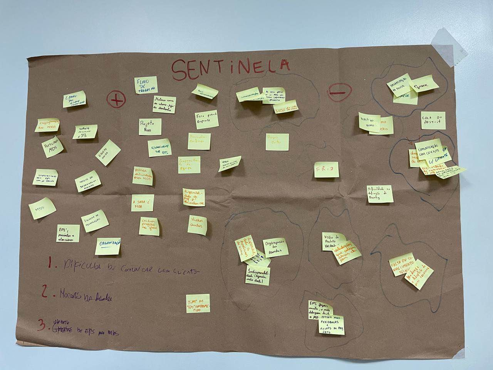

# Retrospectiva de retomada de atividades

Foi feito atividade de retrospectiva em sala aula com as turmas de EPS e MDS que resultaram em três reflexões principais.

1) Dificuldade de comunicar com o cliente.

2) Horário das agendas.

3) Updates de EPS para mds.

## Histórico de versão

| Alteração | Data | Autor | 
| - | - | - |
| Criação do documento | 15/07/24 | Victor Yukio |