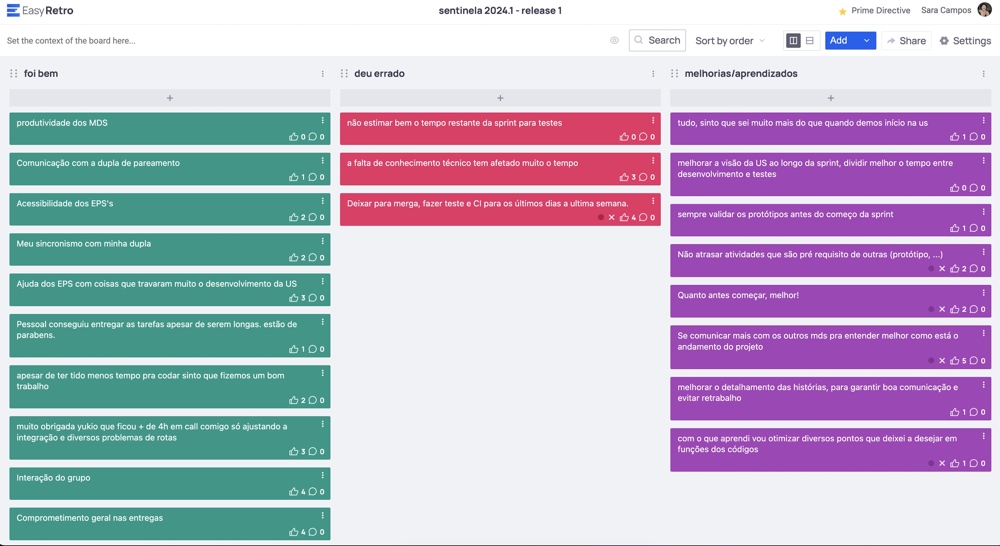

# Retrospectiva da Release 1

## Pontos positivos e negativos

Foi bem: muito aprendizado e produtividade dos MDS, apoio dos EPS, interação e comprometimento do grupo

Deu errado: estimativas de tempo para entrega e conhecimento raso sobre as tecnologias

Lições aprendidas: iniciar a sprint com tudo já validado e estimar melhor o tempo da sprint pensando em desenvolvimento e testes

## Histórico de versão

| Alteração            | Data     | Autor       |
| -------------------- | -------- | ----------- |
| Criação do documento | 08/09/24 | Sara Campos |
