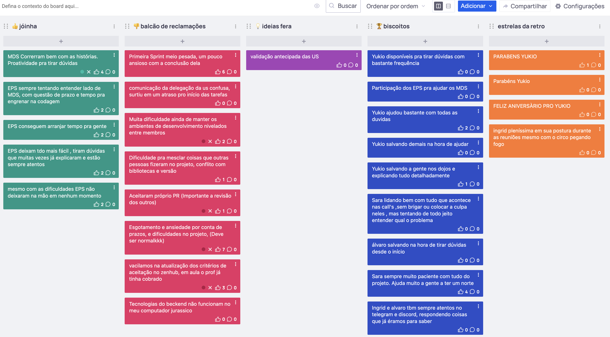

# Retrospectiva 29/07

## Pontos positivos e negativos

Coisas boas: conduta e apoio dos EPS, conhecimento e ritmo de trabalho do MDS e validações de US.

Coisas ruins: problemas referentes ambiente, volume de trabalho e erros cometidos.

## Histórico de versão

| Alteração            | Data     | Autor       |
| -------------------- | -------- | ----------- |
| Criação do documento | 08/09/24 | Sara Campos |
