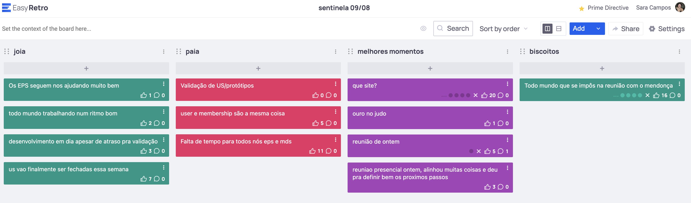

# Retrospectiva 09/08

## Pontos positivos e negativos

Coisas boas: apoio dos EPS, ritmo de trabalho dos MDS e uma reunião de alinhamento realizada entre aulas com o time.

Coisas ruins: dificuldade de comunicação com cliente, atraso de validações e volume de trabalho.

## Histórico de versão

| Alteração            | Data     | Autor       |
| -------------------- | -------- | ----------- |
| Criação do documento | 08/09/24 | Sara Campos |
