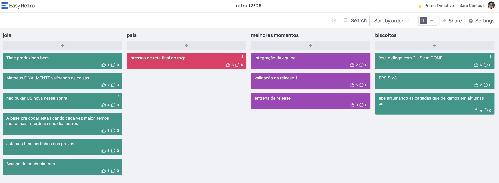

# Retrospectiva 12/08

## Pontos positivos e negativos

Coisas boas: apoio dos EPS, ritmo de trabalho dos MDS, integração do time e US validadas.

Coisas ruins: pressão da reta final.

## Histórico de versão

| Alteração            | Data     | Autor       |
| -------------------- | -------- | ----------- |
| Criação do documento | 08/09/24 | Sara Campos |
