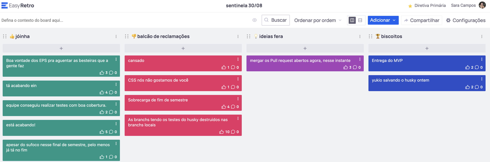

# Retrospectiva da Release 1

## Pontos positivos e negativos

Coisas boas: entrega do MVP, apoio dos EPS, boa cobertura de testes e a chegada da reta final.

Coisas ruins: cansaço, dificuldade com CSS e problemas com husky.

## Histórico de versão

| Alteração            | Data     | Autor       |
| -------------------- | -------- | ----------- |
| Criação do documento | 08/09/24 | Sara Campos |
