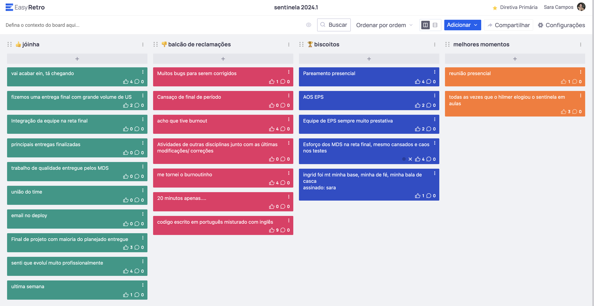

# Retrospectiva da Release Final

## Pontos positivos e negativos

Coisas boas: entregas finalizadas, apoio dos EPS, trabalho dos MDS, evolução pessoal, pareamentos presenciais e reconhecimento do professor.

Coisas ruins: cansaço, bugs, tempo curto para apresentar a quantidade de coisas que foram feitas.

## Histórico de versão

| Alteração            | Data     | Autor       |
| -------------------- | -------- | ----------- |
| Criação do documento | 08/09/24 | Sara Campos |
